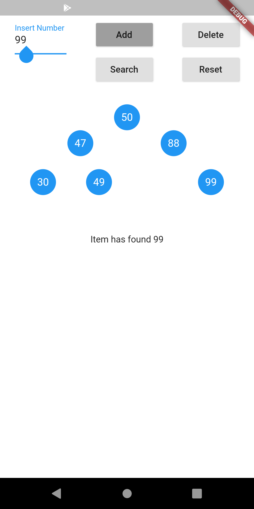
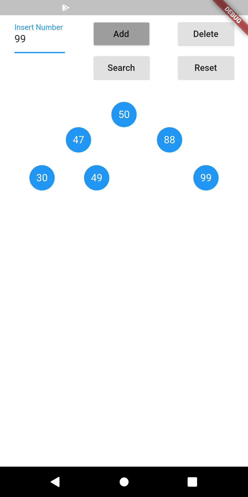

# Balance Tree App

### This task giving me during my software development course & I've told to make this as an console app in C#. 
### But I have changed the basic of it and added some visualisation with Flutter in Dart language. 
### And I submit my little assignment with this app 
### This is absolutely useless app that I spent more than week to figure out how and as result I get to learn 
### how AVL tree is working. I hope you did get better task during your development journey 
 

 