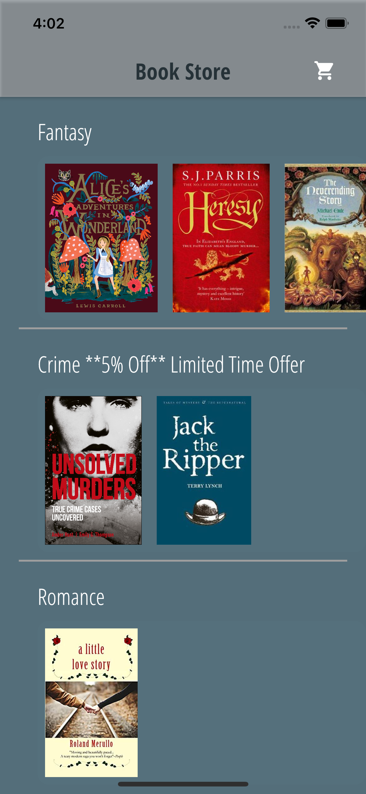
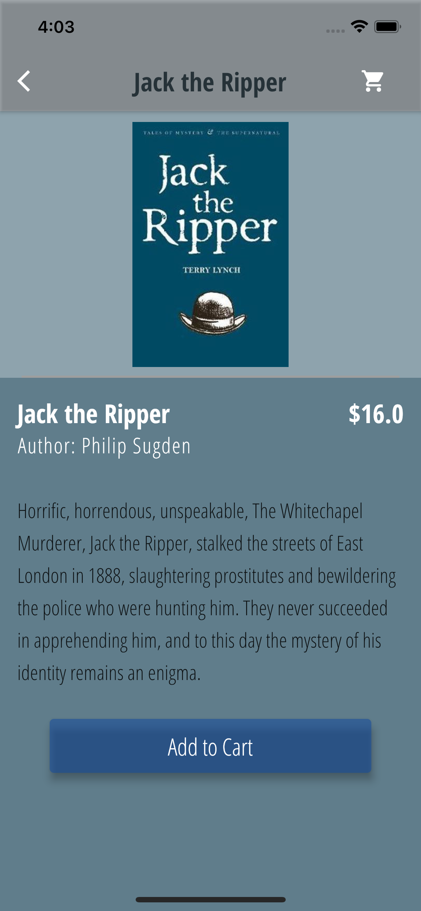
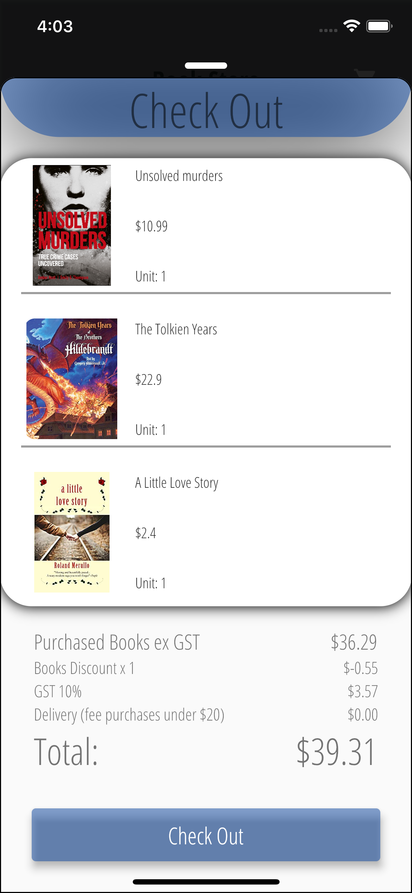

<!DOCTYPE html>
<html>
<body>

<h2>Online Book Store App</h2>

Responsive online Book store has open available on every platform 
This Application inspired from interview test 
I was given a simple task to make console app but I guess 
Someone took that to little higher level Oops😅 
Thanks for the insparation inSight - Chris 
 

<!--   
 -->
    
<!--   

  
 -->
    
    

</body>
</html>
