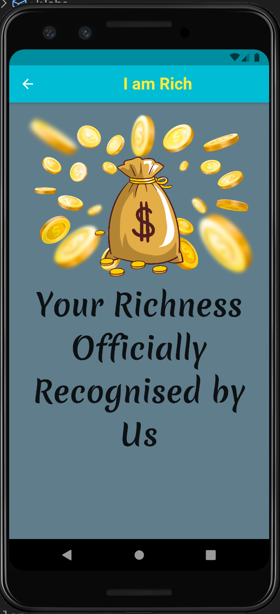

<!DOCTYPE html>
<html>
<head>
<meta name="viewport" content="width=device-width, initial-scale=1">

</head>
<body>

<h2>I am Rich App</h2>

This where I start my Flutter Journey but I haven't stopped learning Flutter & Dart 
I have restructred this old School App and turned into something else. I probably spent more time 
than I shouldn't have but I love the story of it. I want to share with all the developers out there 
I love when some thinks out side the box,gets through the system and makes a story for it. 
 

  

    
  

  

    
  

  

    
  

  

    
  

  

    
  

  

    
  

  

    
  

</body>
</html>