# Profiterol Porfolio App

#### Profiterol App contains 15 different apps. This project is my Master Peace where I combine all my skills and place them all into small app. 
#### Took me about 3 months building from scratch including the design and It's ready be publish to App & Play Stores. 

- ### Authentication with Credential	
- ### Sign in With Third Party Such as (Facebook & Google)
- ### Models	
- ### Third Party Libraries
- ### Stream & Future Builders	
- ### Services	
- ### Fetching /Parsing Raw Data
- ### Real Time Communication	
- ### Database	
- ### Internal & External Storages	
- ### Bloc

### If you wish to see the code please feel free to reach or send a request.  

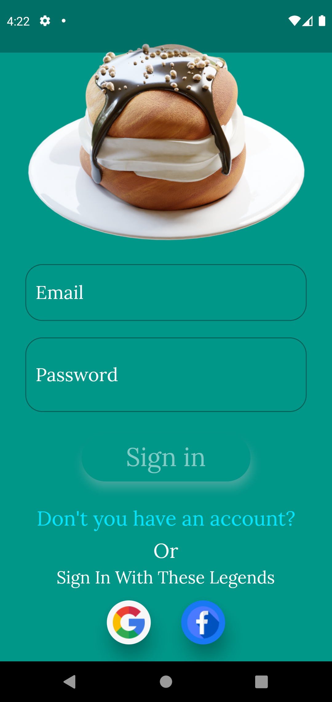

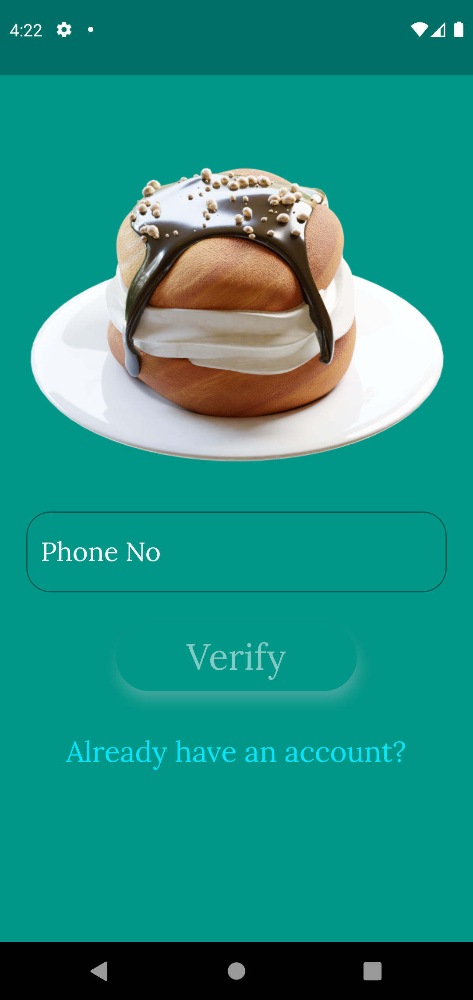
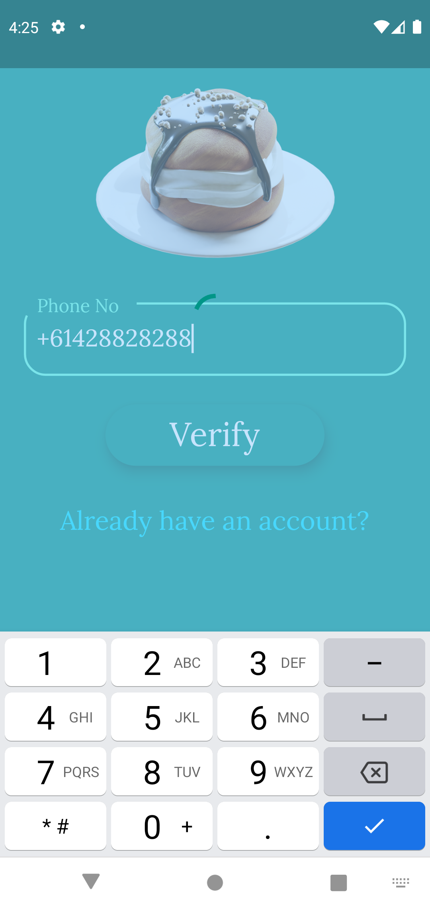
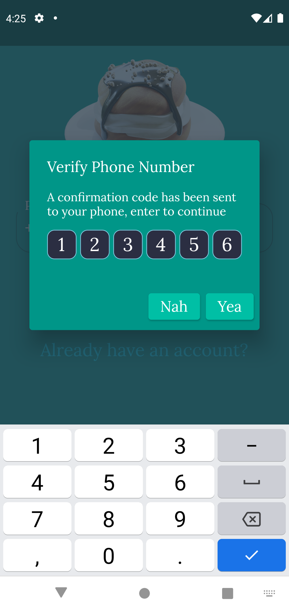
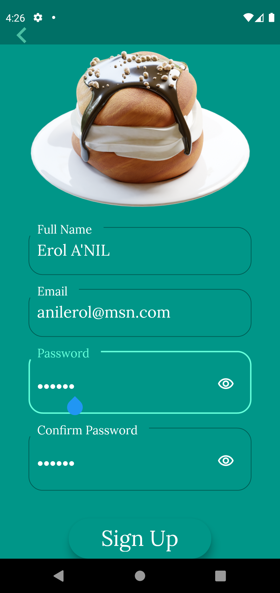
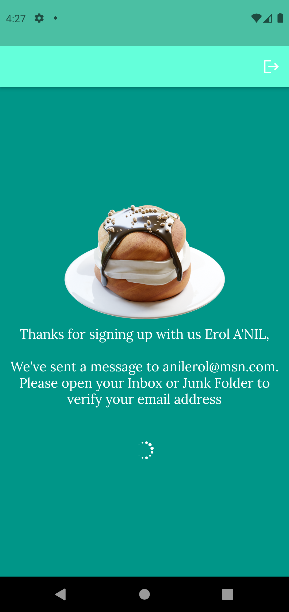
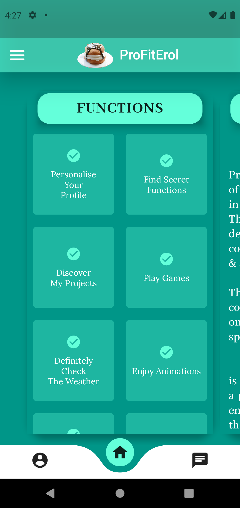
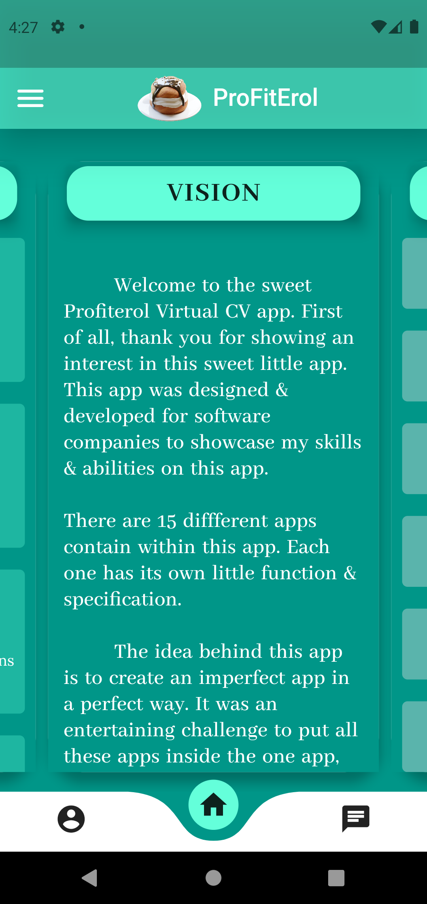
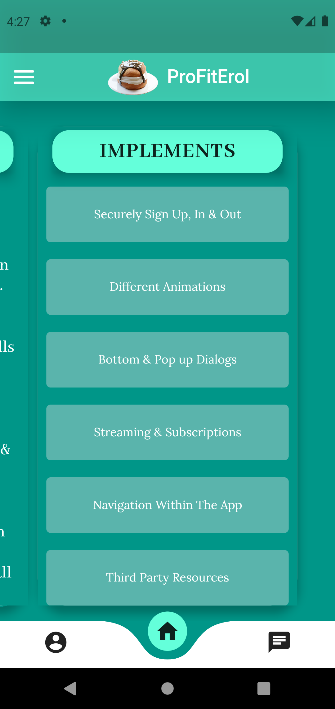
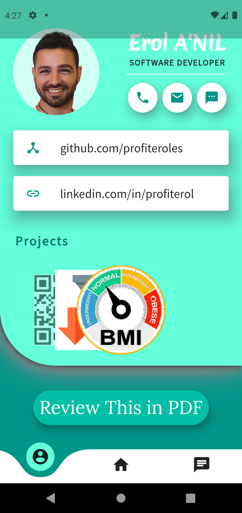
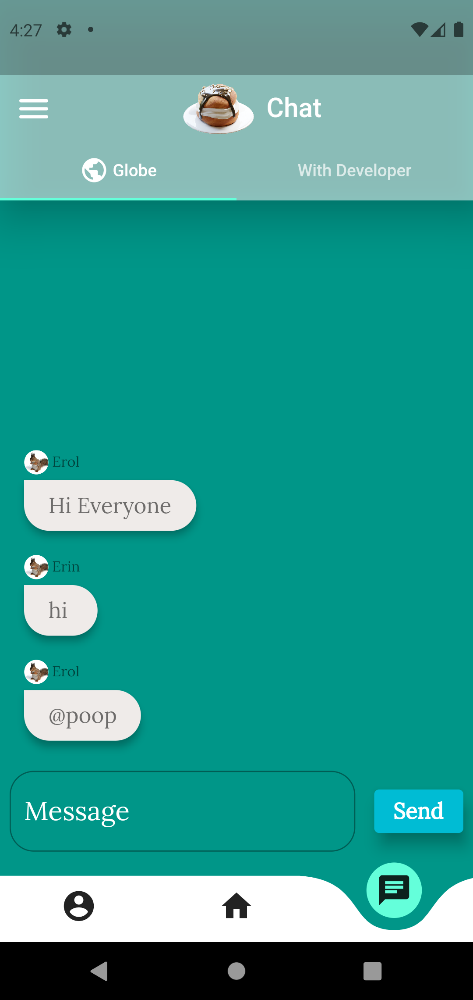
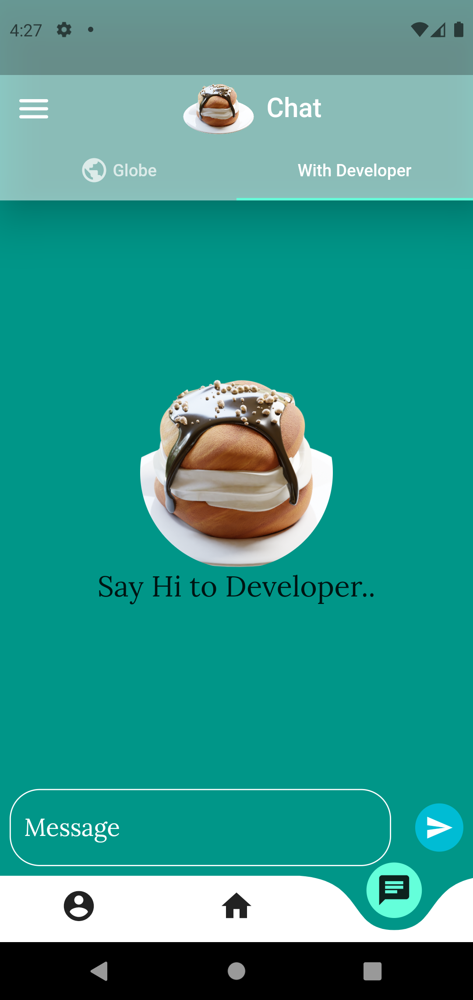
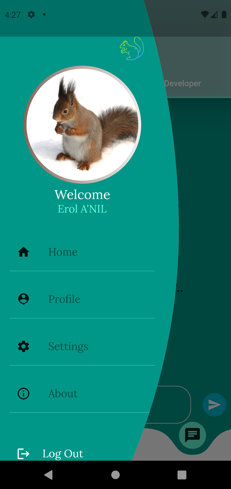
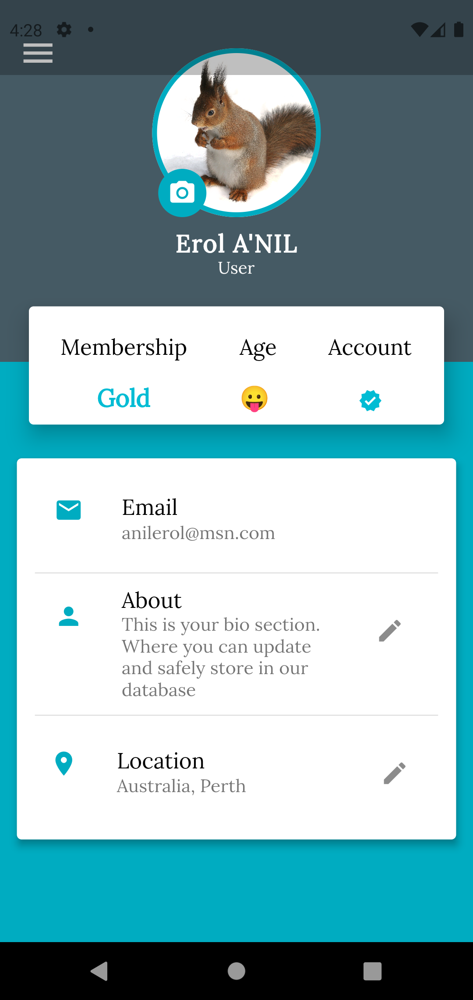
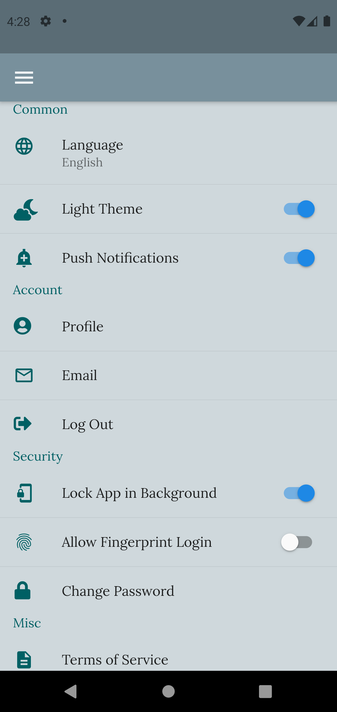
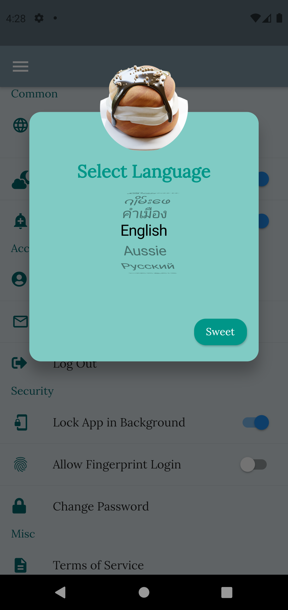
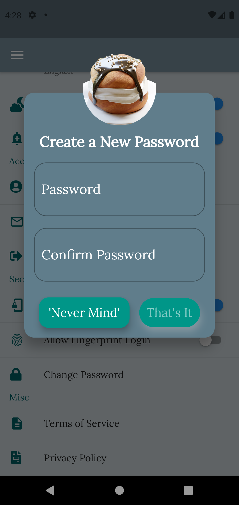
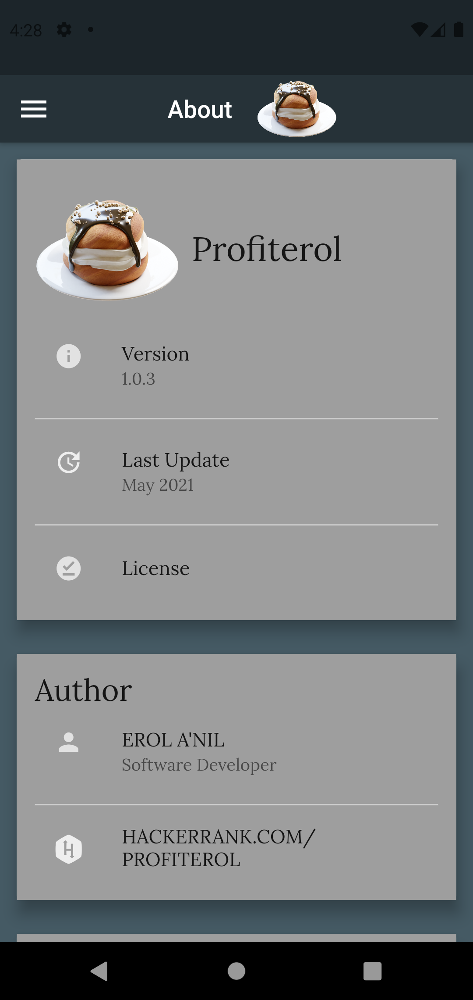
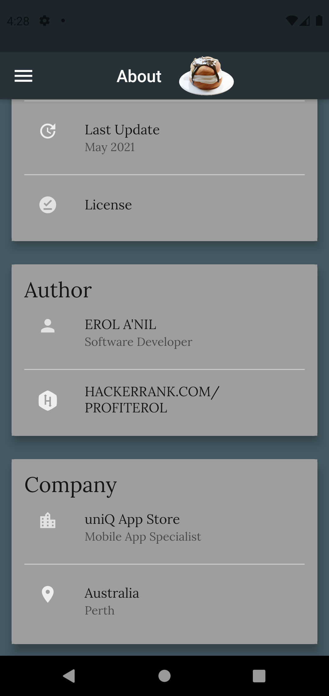

