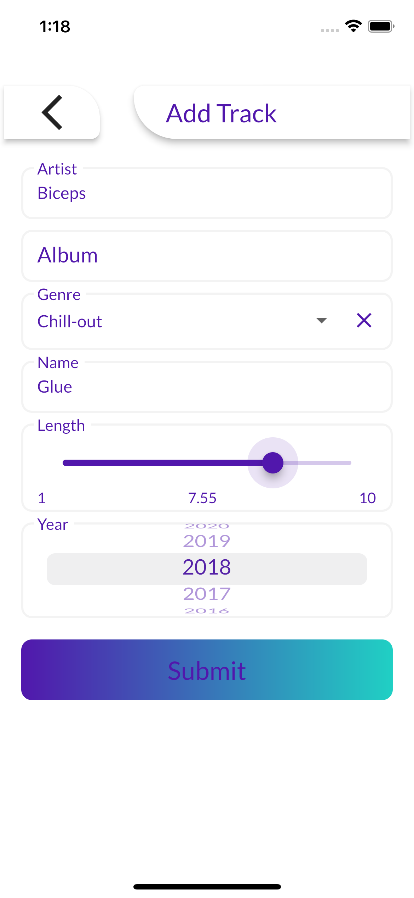
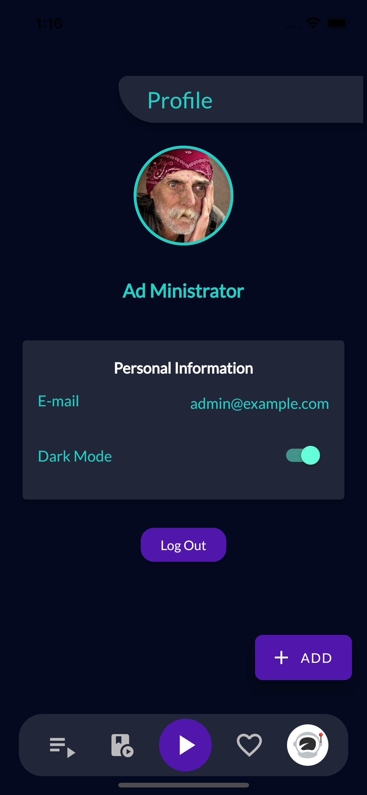
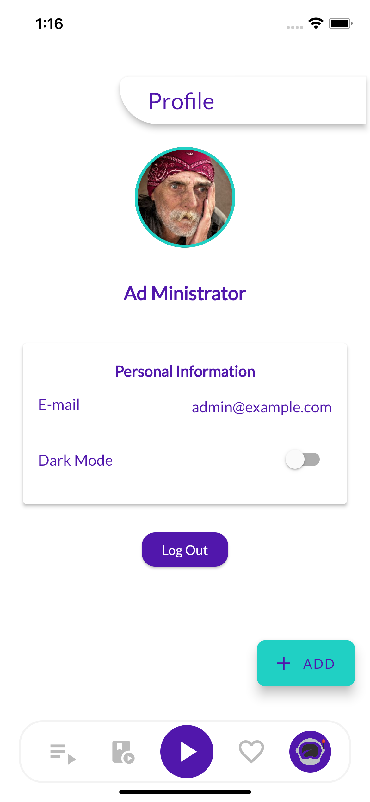
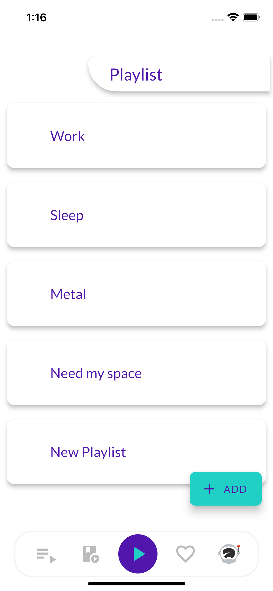
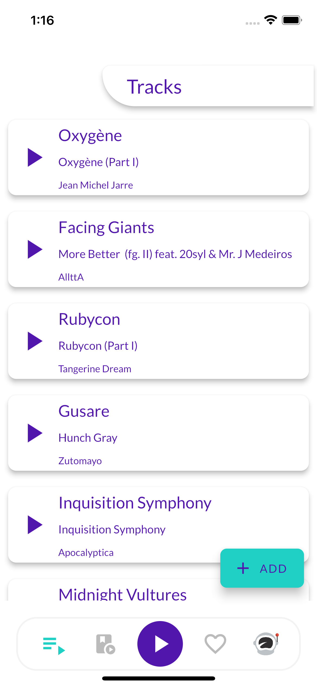
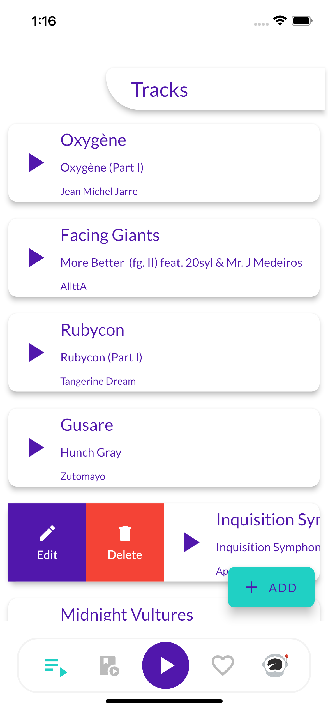

# SPACE JUKE

#### A new Custom Complex mobile application inspired from Laravel 8 <a href="https://github.com/profiteroles/PHP-Laravel-Projects/tree/main/space_juke">SPACE CUBE</a> Web Application.

- ### Clean Architechture
- ### GetX State Management
- ### Local Container within Docker
- ### Theme Implementation

# Screenshots

