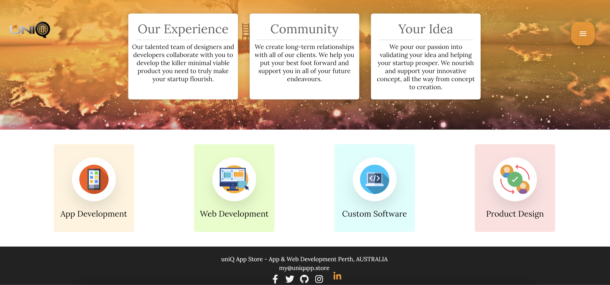
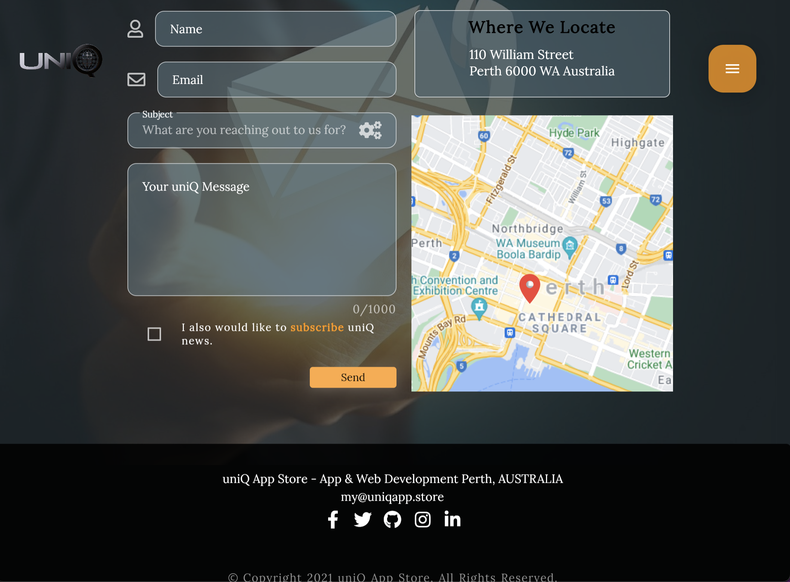

# uniQ App Store - Web Site

## Build with Amazing Flutter 2.2   

### Idea behind this is to show the power Flutter across many platforms. But this time I have focused on building my own unique web site with Flutter 2.2. It's dynamic, responsive and Powerful.  

### If you wish to experience it yourself please visit www.uniqapp.store for full experience.

