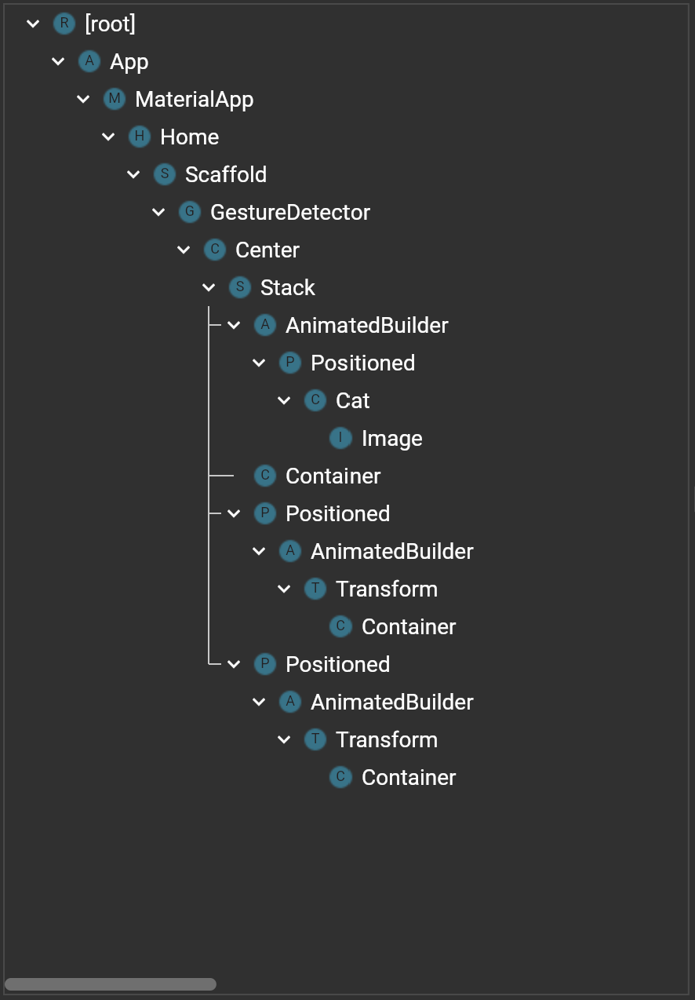
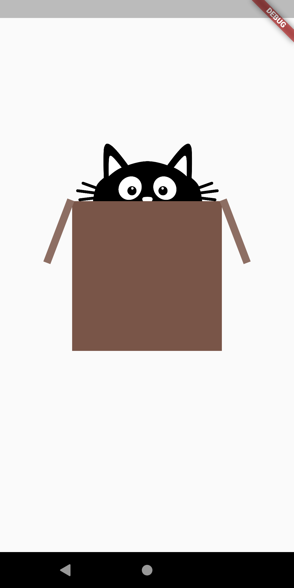
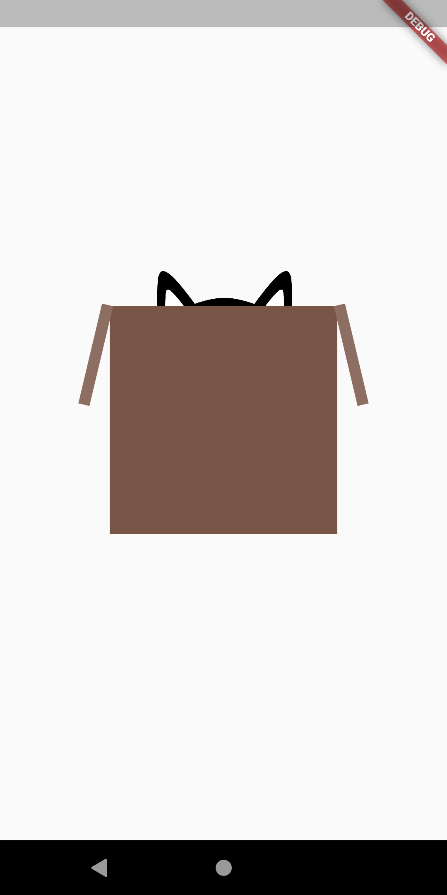

<!DOCTYPE html>
<html>
<body>

<h2>What's in The Box</h2>

Animations are big part of the programming. Nowadays you barely come across with an app which doesn't have 
any animation. So in this cute little example you see how we implement animations and animations controllers 
to our app. 
 

    
    
    

</body>
</html>
